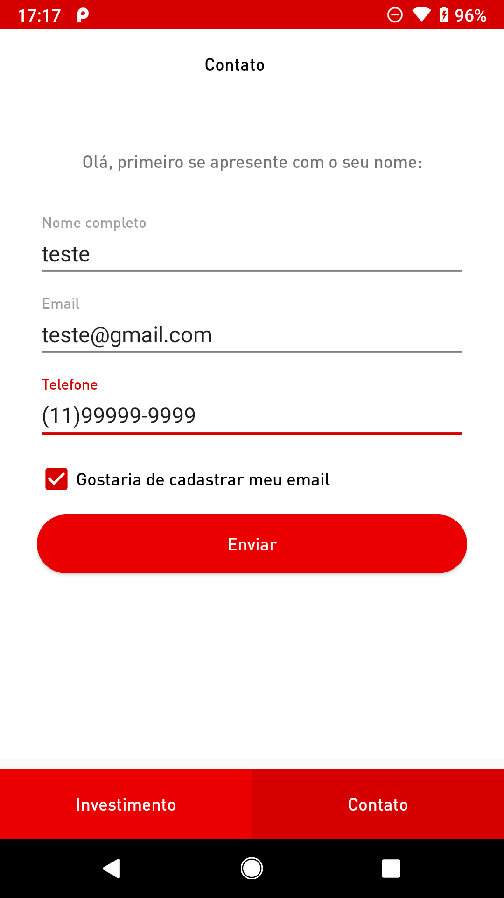
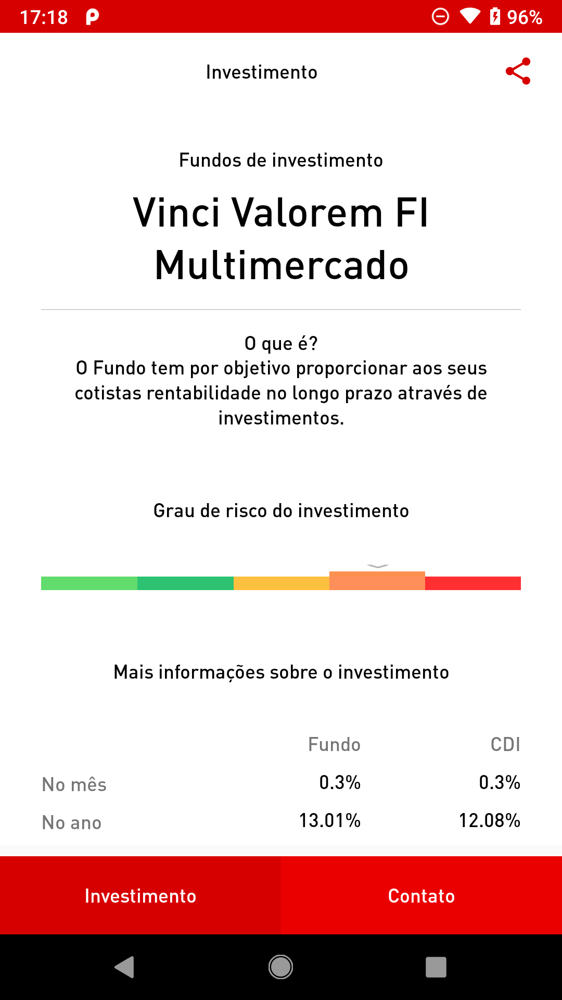
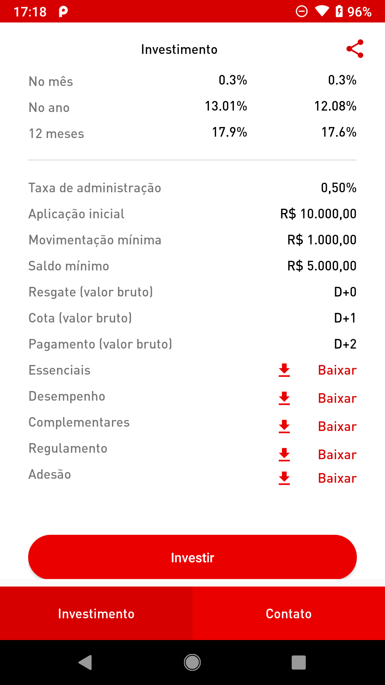

# Desafio Santander Android:

<p align="center">
  
  
  
  
</p>

1. [Introdução](#introduction) 
2. [Requisitos](#requirements) 
3. [Arquitetura](#architecture) 
   * [Formulários Contato](#contact) 
   * [Ativo financeiro](#fund) 
4. [Recursos](#resources)
5. [Considerações](#considerations)
5. [Instalação](#setup)  
6. [Licença](#license)

<a name="introduction" />
## Introdução

Desafio proposto pelo Banco Santander para as vagas de desenvolvedor Android. Você deve fazer um aplicativo de acordo com as instruções. O próprio Santander disponibilizou uma imagem com uma referência do que teria de ser as telas e os endpoints JSON para consumo. No fluxo do aplicativo, o usuário visualiza um formulário construido de forma dinâmica, podendo preencher um pequeno formulário de contato e abrir um resumo de um ativo financeiro, com algumas informações resumidas.

<a name="requirements" />
## Requisitos:

1. Criar uma tela de contatos com um formulário dinâmico, consumindo um JSON que preenche os campos na tela.
2. Fazer validações para campo vazio, email inválido e formatação de telefone.
3. Após o preenchimento correto dos dados de contato, deverá exibir uma tela simples com uma mensagem de sucesso, e a possibilidade de realizar um novo cadastro de contato.
4. Criar uma tela de um ativo financeiro, consumindo os dados de preenchimento através de um JSON.
5. O layout das telas está no arquivo telas.png.
6. Utilizar MVP Clean.

<a name="architecture" />
## Arquitetura

A arquitetura utilizada foi a Model View Presenter (MVP). 

<a name="contact" />
### Formulário Contato

Na tela do formulário de contato, foi consumido o JSON via biblioteca Retrofit, guardando os dados adquiridos em suas respectivas classes Model, e por fim, varrendo as mesmas para trazer os devidos resultados em sua respectiva tela.

### Ativo financeiro

Na tela do ativo financeiro, foi consumido o JSON também via biblioteca Retrofit, guardando os dados adquiridos em suas respectivas classes Model, e por fim, varrendo as mesmas para trazer os devidos resultados em sua respectiva tela.

<a name="resources" />
## Recursos

 1. **MVP**, como arquitetura;
 2. **Java**, como linguagem de programação;
 3. **Retrofit**, para requisições HTTP;
 4. **@SerializedName**, para contornar as inconsistências de um dos JSONs;
 5. **Junit e Mockito**, para testes unitários.

<a name="considerations" />
## Considerações

Os dois endpoints apresentam erros de estrutura de dados e estrutura do JSON. Um deles, impede a formação de POJOs. 

Foi criado uma classe Utils para fazer a validação simples do formulátio de contato.

<a name="setup" />
## Instalação

Para rodar esse projeto utilize uma das seguintes formas:

Instale o APK disponível na raíz do projeto (app-desafio-santander)

ou

Clone o repositório na sua máquina.
Faça o build da aplicação utilizando Android Studio ou via terminal com ```./gradlew assembleDebug```

<a name="license" />
## Licença
<aside class="notice">
  
Copyright 2019 Ricardo Sousa

</aside>