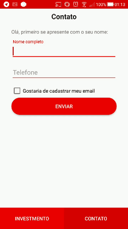
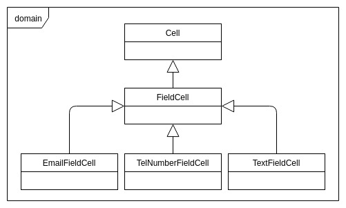
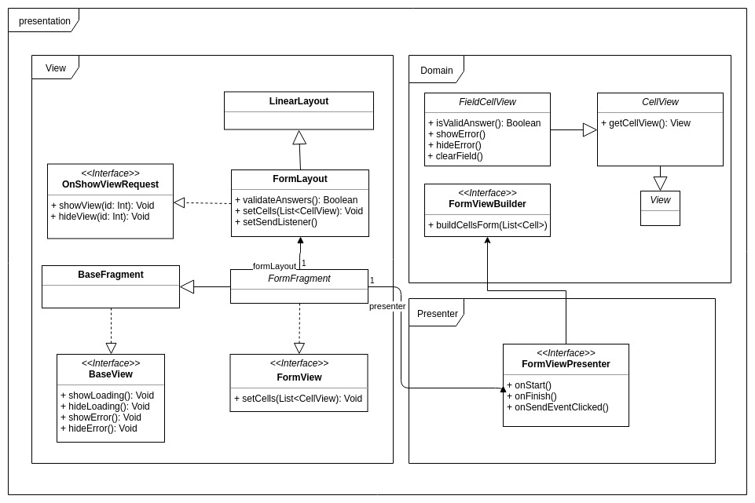

# Desafio Santander Tecnologia - Android:

<p align="center">
  
</p>

1. [Introdução](#introduction) 
2. [Requisitos](#requirements) 
3. [Arquitetura](#architecture) 
   * [Formulários dinâmicos](#form) 
   * [Ativo financeiro](#asset) 
4. [Recursos](#resources)
5. [Considerações](#considerations)
5. [Instalação](#setup)  
6. [Licença](#license)
<a name="introduction" />

## Introdução

Desafio proposto pelo Santander Tecnologia para vaga de desenvolvedor Android. O desafio consiste em construir uma aplicação conforme layout proposto, onde o usuário visualiza um formulário construido de forma dinâmica de acordo com API e também pode visualizar informações de um ativo financeiro.
<a name="requirements" />

## Requisitos:

1. Criar uma tela com formulário dinâmico, com campos definidos pelo JSON retornado da API.
2. Ao preencher de forma incorreta, deve apresentar os erros.
3. Ao preencher de forma correta, deve exibir mensagem de sucesso e possibilidade de enviar uma nova.
4. Criar uma tela para exibir informações de um ativo financeiro, onde as informações são fornecidas por uma arquivo JSON da API.
5. Deve seguir o layout conforme arquivo telas.png
6. Utilizar MVP Clean
<a name="architecture" />

## Arquitetura

Para ter uma arquitetura mais limpa, foi utilizado package by feature. 
<a name="form" />

### Formulários dinâmicos

Para suportar a criação de formulário dinâmicos foi criado na camada de domínio a seguinte representação:

**Cell**: Representação de uma célula do formulário. 

**FieldCell**: São representações de campos onde é necessário algum tipo de validação. 

<p align="center">
  
</p>

Para criar layouts dinâmicos, cada célula do formulário tem uma classe que representa seu layout. Para realizar a transformação das informações de domínio para apresentação, foi criado o ```FormViewBuilder```.

Para orquestrar todas as células de um formulário, como eventos para exibir outra view, verificar erros, limpar todos campos do formulatório etc, foi criado um ```custom layout```, o ```FormLayout```.

<p align="center">
  
</p>
<a name="asset" />

### Ativo financeiro

Um ativo possui muitas informações dentro de uma única tela. Para facilitar implementação e futuras manutenções, foi criado os seguinte ```custom layouts```:

* **HeaderAssetLayout**
* **InfoListView**
* **RiskScaleLayout**
* **MoreInfoLayout** (preciso encontrar um nome melhor)

No fim, AssetFragment é composto pela combinação deles, apenas repassando as informações para cada componente para que cada um cuide de como e onde deve apresentar seu respectivo dado do ativo financeiro.
<a name="resources" />

## Recursos

 1. **Clean Architecture**, como base na criação de uma feature, tentando minimizar overengineering;
 2. **Kotlin**, como linguagem de programação;
 3. **Dagger2**, para injeção de dependências;
 4. **RxJava2**, para ajudar a ter uma arquitetura mais reativa;
 5. **Retrofit**, para requisições HTTP, com rxAdapter;
 6. **Junit e Mockito**, para testes unitários;
 7. **MockWebServer**, para testes unitários que fazem requisições de rede.
<a name="considerations" />
 
## Considerações

Os dois endpoints apresentam erros de estrutura de dados e estrutura do JSON. Alguns impedem a formação de POJOs e alguns impedem de fazer o parse. 

A camada de dados, tanto da form quanto da asset, foram preparadas para tratar esses erros. Não é o ideal, porém foi um "workaround" para aplicação não parar e conseguir lidar com os erros.
<a name="setup" />

## Instalação

Para rodar esse projeto utilize uma das seguintes formas:

Instale o APK disponível na seção de release

ou

Clone o repositório na sua máquina.
Faça o build da aplicação utilizando Android Studio ou via terminal com ```./gradlew assembleDebug```

<a name="license" />

## Licença
<aside class="notice">
  
Copyright 2018 Victor Vieira Paulino

Licensed under the Apache License, Version 2.0 (the "License");
you may not use this file except in compliance with the License.
You may obtain a copy of the License at

    http://www.apache.org/licenses/LICENSE-2.0

Unless required by applicable law or agreed to in writing, software
distributed under the License is distributed on an "AS IS" BASIS,
WITHOUT WARRANTIES OR CONDITIONS OF ANY KIND, either express or implied.
See the License for the specific language governing permissions and
limitations under the License.

</aside>
